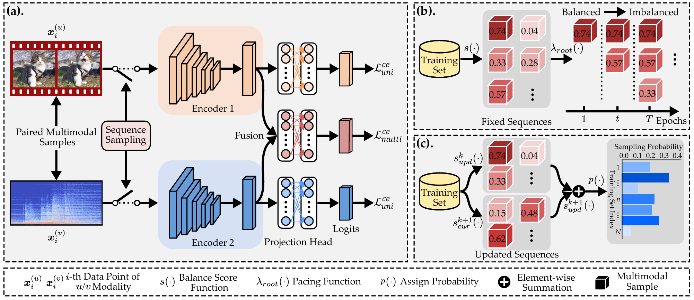

# Balance-aware Sequence Sampling Makes Multimodal Learning Better
This repo is the official implementation of _Retrieval-Balance-aware Sequence Sampling Makes Multimodal Learning Better_ accepted by IJCAI 2025. 

## Framework


## Environment Configuration
First, clone this repo:
```shell
git clone https://github.com/njustkmg/IJCAI25-BSS.git

cd IJCAI25-BSS
```
First, create a new conda env for BSS:
```shell
conda create -n BSS python=3.7
```
Next, activate this env and install the dependencies from the requirements.txt:
```shell
conda activate BSS

pip install torch==1.7.1+cu110 torchvision==0.8.2+cu110 torchaudio==0.7.2 -f https://download.pytorch.org/whl/torch_stable.html

pip install -r requirements.txt
```

## Data Preparation
* Download the CREMA-D dataset from this link: https://github.com/CheyneyComputerScience/CREMA-D
* Download the Kinetics-Sounds dataset from this link: https://github.com/cvdfoundation/kinetics-dataset
* Download the Sarcasm dataset from this link: https://github.com/feiLinX/Multi-modal-Sarcasm-Detection
* Download the Twitter15 dataset from this link: https://github.com/jefferyYu/TomBERT
* Download the NVGresutre dataset from this link: https://research.nvidia.com/publication/2016-06_online-detection-and-classification-dynamic-hand-gestures-recurrent-3d

The directory organization of the final data file should be as follows (task CREMA-D as an example):
```
├── CREMAD/
│   ├── annotations/
│	│	├── train.csv
│	│	├── test.csv
│   ├── AudioWAV/
│	│	├── 1001_DFA_ANG_XX.wav
│	│	├── 1001_DFA_DIS_XX.wav
│	│	├── ...
│   ├── Image-01-FPS/
│	│	├── 1001_DFA_ANG_XX
│	│	├── 1001_DFA_DIS_XX
│	│	├── ...
│   ├── Image-01-FPS-SE/
│   ├── wav_pkl/
│	│	├── 1001_DFA_ANG_XX.pkl
│	│	├── 1001_DFA_DIS_XX.pkl
│   ├── sound_preprocessing.py
```

### Training & Evaluation
Run the following command to train the model and evaluate the results (task Kinetics-Sounds as an example):
```shell
cd KS

python train-CL.py

python train-SPL.py
```
Note that CL and SPL  denote the proposed method with the heuristic scheduler and learning-based scheduler, respectively.

## Citation
If you find the code useful for your research, please give us a star ⭐⭐⭐ and consider citing:
```
@inproceedings{guan2025balanceaware,
  author       = {Zhi{-}Hao Guan and
                  Qing{-}Yuan Jiang and
                  Yang Yang},
  title        = {Balance-aware Sequence Sampling Makes Multimodal Learning Better},
  booktitle    = {IJCAI},
  year         = {2025}
}
```
